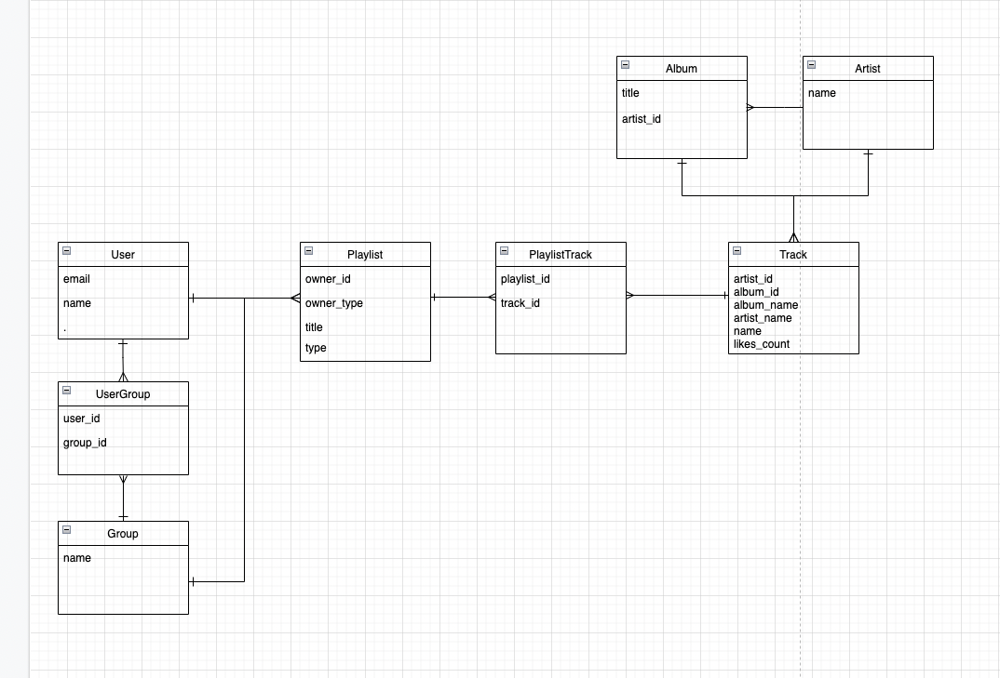

# README

## 환경 세팅
- docker-compose 기반 프로젝트입니다. docker-compose up 명령어로 실행해주세요.
- env.docker.example 에서 .example만 지우고 사용하시면 됩니다.
- bundle install / db create, migrate, seed 명령어는 shell script를 통해 자동으로 실행됩니다.
- 실행 후 elasticsearch container에 문제 발생시 docker-compose down 한 뒤 재실행 해주세요.

 

## Swagger
- rswag을 이용, api documentation을 하였습니다.
- endpoints에 대한 상세한 설명은 아래 링크를 참고하시면 됩니다.
- docker-compose up 명령어로 실행 후 http://localhost:3000/api-docs/index.html 에서 확인 가능합니다.

 

## test
- rspec을 이용, 테스트 케이스를 작성하였습니다.

 

## ERD

- User (사용자)
- UserGroup (그룹 참여 사용자)
  - uniqueness on user_id and group_id
- Group (그룹)
- Playlist (재생목록, 내앨범)
  - owner(user, group) : polymorphic association 
  - type : default(재생목록), my_album(내 앨범)
- PlaylistTrack (재생목록에 추가된 음원)
- Track (음원)
- Album (앨범)
- Artist (가수)

 

## 시나리오
- User (사용자)
  - 사용자 생성 시 default 타입(재생목록)의 playlist를 생성합니다.
- Group (그룹)
  - group 생성 시 default 타입(재생목록)의 playlist를 생성합니다.
  - group을 생성한 사용자가 group의 owner가 됩니다.
  - group의 owner만 group을 수정, 삭제할 수 있습니다.
- UserGroup (그룹 참여 사용자)
  - group의 owner만 group에 사용자를 추가, 삭제할 수 있습니다.
  - group에 동일한 사용자가 중복하여 참여할 수 없습니다.
- Playlist (재생목록, 내앨범(추가사항))
  - owner(user, group) : polymorphic association 
  - user와 group 생성시 자동으로 default type의 playlist가 생성되므로 my_album type의 playlist만 추가로 생성, 수정, 삭제할 수 있습니다.
  - my_playlist 액션을 통해 본인 혹은 본인이 속한 그룹의 playlist를 가져올 수 있습니다.
  - index와 show 액션을 통해 다른 사람 혹은 그룹의 my_album을 확인할 수 있습니다. 
- PlaylistTrack (재생목록에 추가된 음원)
  - 재생목록에는 100개의 음원만 추가할 수 있고 100개가 넘어갈시 가장 오래된 음원부터 삭제합니다.
  - playlist의 owner(user, group)에 속하는 user만 생성, 삭제할 수 있습니다.
  - user_id를 통해 추가한 사용자를 알 수 있습니다.
  - 곡의 중복이 가능합니다.
  - index action을 통해 playlist의 playlist_tracks 및 tracks를 조회할 수 있습니다.
- Track (음원)
  - track의 필터링을 위해 elasticsearch를 사용하였습니다.
  - track에 대한 필터링은 q(title, artist_name, album_name), artist_id, album_id로 가능합니다.
  - track에 대한 정렬은 created_at, likes_count로 가능합니다.
- Album (앨범)
  - title 변경 시 album에 속한 track들의 album_name이 변경됩니다.
- Artist (가수)
  - name 변경 시 artist에 속한 track들의 artist_name이 변경됩니다.
